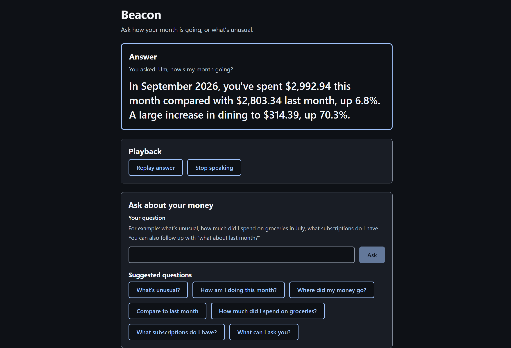

# Beacon

Beacon answers questions about your finances, for the visually impaired who cannot read a screen.
You can ask it "what's unusual this month?" and it answers in a sentence, using figures it calculated from your transactions.

Built by Sudarshan Kumar Kaushik and Hruday Tamboli. Submitted to SteelHacks. MIT licensed.



## The problem

Banking apps have become navigable with a screen reader. Two decades of litigation and
regulation made logging in, reading a balance and paying a bill work for blind and low-vision users at most major banks. But independently being able to understand your own financial position has never been possible. A screen reader can read what is on the screen, and no screen in a banking app says "this month is unusual". That sentence does not exist until something computes it.

- [8,537,000 people in the US](https://disabilitycompendium.org/) reported blindness or
  serious difficulty seeing even with glasses in 2024.
- Blind participants took twice as long as sighted users on sites with poor accessibility,
  and five times as long when they had to contact customer service to finish the task
  ([Griffith, Wentz & Lazar, 2022](https://doi.org/10.1093/iwc/iwad004), cited in the US
  Department of Justice's regulatory analysis for the ADA Title II web rule).
- A 2026 scoping review of 23 studies across 12 countries
  ([Puli et al., JMIR](https://doi.org/10.2196/82315)) found that the evidence gaps are
  widest at the stage where people live with a financial product over time, and that no study
  has evaluated whether conversational interfaces reduce these barriers. Beacon is an attempt
  at the thing that review asked for.

## What it does

Every exchange below is copied from `logs/turns.jsonl`, which is a json file with our real testing runs.

> **What's unusual?**
> In September 2026, your spending is normal except for three things: three new subscriptions
> you didn't have before, Paramount Plus, Audible, and CloudVault, totaling $47, a dining
> category outlier at $314.39, up 70.3% on your usual $184.63, and Corner Bistro charged you
> $38.50 twice, which may be a duplicate.

> **And last month?**
> Nothing stands out in August 2026. Your spending looks normal.

The second answer shows two things that matter for speech. A follow-up keeps the subject of
the previous question, so you do not have to repeat yourself, and a question with no
interesting answer gets a short one.

Beacon handles scoped questions ("how much did I spend at Kroger in July?"), counts ("how
many times did I eat out?"), superlatives ("what was my biggest purchase?"), lists ("what
subscriptions do I have?"), income and savings ("am I saving money?"), and trends ("is my
dining spending going up?"). Questions it cannot answer from a transaction history, such as a
bank balance or a transfer, are declined in one sentence. Requests for advice are refused by
a hardcoded path that never reaches the model, because advice delivered by voice to someone
who cannot check it is a critical point of failure beacon avoids.

You can use Beacon by voice or by typing, and both give the same answer because both run
through the same function.

## How it works

```
your question
     │
     ▼
  planner  ── Nemotron decides what to measure, about what, over which period
     │
     ▼
  pandas   ── computes every figure from the ledger
     │
     ▼
 narrator  ── Nemotron turns those figures into a sentence
     │
     ▼
  guards   ── check every number and every name in that sentence
     │
     ▼
   speech  ── ElevenLabs speaks it; the same text appears on screen
```

The model decides what the question means and how to word the reply. It never does
arithmetic. The planner returns a short plan, such as "total spent on groceries in July",
and pandas executes that plan against the ledger. A sighted user who hears a wrong figure can
glance at the screen and catch it, our user cannot. Which is why we implemented the robust computing pipeline using inference from nemotron

The model is also kept away from the raw data. It receives precomputed aggregates: six months
of totals, this month's categories and merchants, the list of recurring charges, and the
anomalies the rules found. It never receives a transaction, an account number, or a balance.
The app displays that exact payload on screen, so you can read what was sent.


## The two guards

The **numeric guard** extracts every number from the model's sentence and checks it against
the facts that were sent. Formatting differences are allowed, so `$47`, `47.00` and
`forty-seven` all match. A number that appears nowhere in the facts fails, including numbers
the model worked out itself. It once said spending was "$189.60 more than last month", which
is a subtraction of two real figures and was never given to it. That answer was blocked.

The **name guard** checks every category and merchant the sentence mentions against the ones
the answer is actually about. This catches a failure the numeric guard cannot see. During a
rehearsal the model said "For groceries in August 2026, you spent $2,803.34", where the
figure was the correct total for the whole month and the label was wrong. Every number in
that sentence was true, and the sentence was still misleading.

When either guard fails, the answer is generated once more, and if it fails again it is
replaced by a deterministic sentence built from the same figures. That fallback is stiffer to
listen to and it is always correct.

Across 145 checks, ten answers were blocked: eight attached a real figure to the wrong
category, and two contained a number the model had calculated. None of them were spoken.

## Accessibility

Voice is one way to use Beacon. Screen reader users
already have text-to-speech and run it faster than any synthesised voice, so the app is built minimally
to be read by their own software as well.

- Semantic HTML throughout, with real buttons, headings in order, and an accessible name on
  every control.
- One polite live region carries the answers. While the voice agent is speaking, the live
  region stays quiet so the screen reader does not talk over it. The transcript still records
  everything, and a setting turns the announcements back on.
- Keyboard operable end to end. Every shortcut has a visible button that does the same thing.
- Text survives 200% zoom, motion respects `prefers-reduced-motion`, and no audio plays
  before you ask for it.

## The data

The demo runs on a synthetic ledger of 1,009 transactions covering August 2025 to September
2026, generated by `data/generate.py` from a fixed seed. Five anomalies are planted in the
current month, and the test suite asserts that the analysis engine finds all five. You can
also upload a CSV, including the messy exports real banks produce, with different column
names and `$` symbols and American date order.

No real accounts are involved. Beacon reads transactions and answers questions. It cannot
move money.

## Running it

You need Python 3.11 (installed by `uv`), Node 22 or later, and an OpenAI-compatible endpoint
serving a Nemotron model. We ran Nemotron 3 Nano 4B on vLLM on an NVIDIA L4 through Brev, and
`scripts/brev_serve.sh` sets that up.

```powershell
uv sync
npm install --prefix frontend
copy .env.example .env      # then fill in the values you need

.\scripts\start-all.ps1     # backend on :8000, frontend on :5173, ngrok tunnel
```

Open http://localhost:5173 and ask a question by typing. For voice you also need an
ElevenLabs agent whose custom LLM points at `https://<your-ngrok-domain>/v1`. Disable the
agent's backup model, so that a failure on our side produces silence. A backup model would
answer the question with no figures in front of it.

Setting `NARRATOR=template` in `.env` runs the entire product with no model and no API keys.
The analysis, the guards, the API and the interface all work, and the answers come from the
deterministic templates.

## Repo layout

| Path | What is in it |
|---|---|
| `backend/analysis/` | Loading a CSV, the anomaly rules, the query engine, the aggregates the model sees |
| `backend/narration/` | The planner, the prompts, the two guards, the deterministic templates |
| `backend/contract.py` | Every API shape, shared with the frontend through a generated TypeScript file |
| `backend/service.py` | The single answer path used by both text and voice |
| `frontend/src/` | React interface, the voice hook, the payload inspector |
| `data/` | The synthetic ledger generator and its fixtures |
| `scripts/` | Setup, checks, and the two evaluation scripts |

## How it is verified

`scripts\check.ps1` runs everything: 110 backend tests, 23 frontend tests, accessibility
linting, an axe check on the interface, and the production build.

- `tests/test_rules.py` asserts that all five planted anomalies are found on two different
  seeds, with no false positives.
- `scripts/eval_parser.py` measures question understanding against 64 questions, including
  paraphrases, speech-to-text noise, follow-ups and curveballs. The current build answers 62
  correctly and misroutes none. The two it gets wrong are still answered sensibly, and
  neither is answered as a different question.
- `scripts/eval_narration.py` measures how often the model's wording passes the guards.
- `logs/turns.jsonl` records every question, answer, plan and guard result. Reading it after
  a rehearsal is how we found most of the bugs worth fixing.

## Limitations

The anomaly thresholds are tuned to the synthetic ledger and would need work on real data.
The planner can still misread a question, which is why answers begin by reading back how the
question was understood. A new question takes between two and four seconds because it costs
two model calls, and a repeated question is faster. Voice needs a network connection, since
speech recognition and speech synthesis both run in the cloud. Nothing is stored between
sessions.

## Licence

MIT. See [LICENSE](LICENSE).
